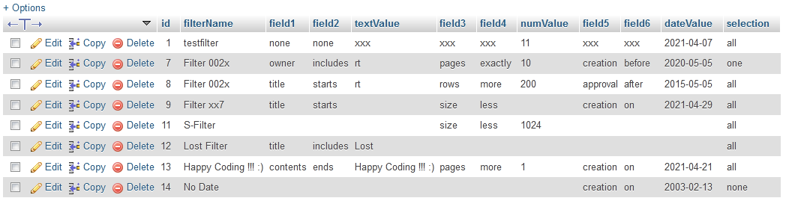

<p align="center"></p>

<h1 align="center">
    <strong>Modal</strong>
</h1>
<h3 align="center">
    <p>Modal Form wit db connection in Java</p>
</h3>

<hr>

### Contents
- [Tools used](#tools-used)
- [Main page](#main-page)
- [Modal window](#modal-window)
- [Filter rows](#filter-rows)
- [Apply Save Cancel](#apply-save-cancel)
- [Database](#database)
- [Servers](#servers)
- [Automated Tests](#automated-tests)
- [Techiniques Used](#techniques-used)
- [Checklist](#checklist)

<hr>

### Tools used
VSCode - https://code.visualstudio.com/ \
Eclipse Version: 2021-03 (4.19.0) - https://www.eclipse.org/downloads/packages/release/kepler/sr1/eclipse-ide-java-developers \
XAMPP v3.2.4 - https://www.apachefriends.org/index.html

<hr>

### Main page

Page on local Tomcat server:  http://localhost:8080/AnyProject/index.html

* On main page there is only one button - 'Show Dialog'
* This button will open the modal window
* Current button is only clickable when modal window not displayed

*Index page is located 'src/main/webapp/index.html'*

<hr>

### Modal window
* Modal window can be closed 3 ways: 
1. by clicking 'x' button on window's upper right corner
2. by clicking 'cancel' button
3. by clicking outside modal window

* Modal window can be resized vertically by dragging right bottom corner
* On smallest height onyl 'Filter name' filed is displayed
* Vertical scrollbar on window's right border

<hr>

### Filter rows
1. Combo - text
2. Combo - numeric
3. Combo - date

* When modal window opens only first filter row displayed
* By clicking 'Add filter options +' reveals other filter rows(combos)
* User can remove filter rows(combos) by clicing '-' button next to it
* Last row can't be removed

<hr>

### Apply Save Cancel
There are currenyl 3 main buttons on modal
1. **Apply filter** - function not implemented
2. **Save filter** - will save current filter into database
3. **Cancel** - closes current modal

<hr>

<p align="center"></p>

### Database
MySQL database - created in *phpMyAdmin* \
* Database name: modal
* Table name: filters

*Database 'modal.sql' inclduded in 'db' folder

<hr>

### Servers
MySQL - Port 3307 \
Tomcat - Port 8080

<hr>

### Automated Tests
* Automated tests are in 'LocalTest.java'

* Selenium WebDriver(v. 3.141.59) is used for Automated tests - https://www.selenium.dev/downloads/
* Tests are done with Chrome browser and Chromedriver
* c:/browserdrivers/ is my path for local drivers
* So in unit tests driver setup is as follows
```
System.setProperty("webdriver.chrome.driver","C:\\browserdrivers\\chromedriver.exe");  
```

*Chromedriver - https://chromedriver.storage.googleapis.com/90.0.4430.24/chromedriver_win32.zip
*Crhomedriver included in 'chromedriver' folder

<hr>

### Techniques Used
Laguages, frameworks, servers etc.

* HTML
* CSS
* JavaScript
* REST
* JSON
* MySQL
* Java
* JSP - https://www.tutorialspoint.com/jsp/index.htm
* Tomcat - http://tomcat.apache.org/
* JUnit - https://junit.org/junit5/
* Selenium - https://www.selenium.dev/

<hr>

### Checklist

| Task | To do | Implemented |
|-|-|-|
| Main page with button to open modal window | | ✓ |
| External CSS styling with classes | | ✓ |
| HTML + CSS + JS frontend | | ✓ |
| Backend Java, Spring, SQL... | | ✓ |
| Modal dialog window open on buttonclick | | ✓ |
| Different elements on modal window as on illustrave image | | ✓ |
| Labels and datafielelds on form | | ✓ |
| Close modal dialog | | ✓ |
| + button implementation(add options) | | ✓ |
| - button implementation(remove option) | | ✓ |
| Only one row on inizialisation | | ✓ |
| Combo(Amount) - Combo(Numbers compare) - Numeric field | | ✓ |
| Combo(Title) - Combo(Text compare) - Text field | | ✓ |
| Combo(Date) - Combo(Date compare) - Date field | | ✓ |
| Fixed size modal window | | ✓ |
| User can resize height | | ✓ |
| Vertical scrollbar on dialog window | | ✓ | 
| REST API and JSON protocol for data transfer for controls | | ✓ |
| Save data with Save button | | ✓ |
| Automated tests | ✓ | |

# HAPPY CODING !!! :)
